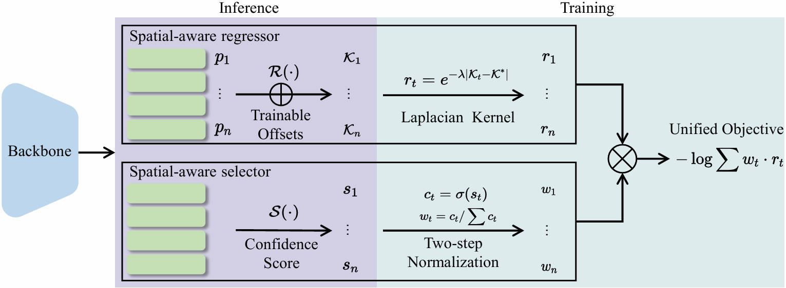

# Spatial-Aware Regression for Keypoint Localization

[[`Paper`](https://openaccess.thecvf.com/content/CVPR2024/papers/Wang_Spatial-Aware_Regression_for_Keypoint_Localization_CVPR_2024_paper.pdf)]

> [Spatial-Aware Regression for Keypoint Localization](https://openaccess.thecvf.com/content/CVPR2024/html/Wang_Spatial-Aware_Regression_for_Keypoint_Localization_CVPR_2024_paper.html)  
> Dongkai Wang, Shiliang Zhang  
> CVPR 2024 *Highlight*



## Installation

### 1. Clone code
```shell
    git clone https://github.com/kennethwdk/SAR
    cd ./SAR
```
### 2. Create a conda environment for this repo
```shell
    conda create -n sar python=3.10
    conda activate sar
```
### 3. Install PyTorch following official instruction (other version may not work)
```shell
    conda install pytorch==2.0.1 torchvision==0.15.2 pytorch-cuda=11.7 -c pytorch -c nvidia
```
### 4. Install other dependency python packages (do not change package version)
```shell
    pip install -U openmim
    mim install mmengine
    mim install "mmcv>=2.0.1"
    mim install "mmpose==1.3.1"
```
### 5. Prepare dataset
Download [COCO ](https://cocodataset.org/#home) and [COCO WholeBody](https://github.com/jin-s13/COCO-WholeBody) from website and put the zip file under the directory following below structure, (xxx.json) denotes their original name.

```
./data
|── coco
│   └── annotations
|   |   └──person_keypoints_train2017.json
|   |   └──person_keypoints_val2017.json
|   |   └──coco_wholebody_train_v1.0.json
|   |   └──coco_wholebody_val_v1.0.json
|   └── images
|   |   └──train2017
|   |   |   └──000000000009.jpg
|   |   └──val2017
|   |   |   └──000000000139.jpg
```
## Usage

### 1. Download trained model

```shell
    git lfs install
    git clone https://huggingface.co/d0ntcare/SAR
    mv SAR weights
```

### 2. Evaluate Model

```shell
    # evaluate on coco val set
    export PYTHONPATH=`pwd`:$PYTHONPATH
    CUDA_VISIBLE_DEVICES=0 mim test mmpose configs/coco-res50.py --checkpoint weights/coco-res50/best_coco_AP_epoch_210.pth
```

### 3. Train Model

```shell
    # train on coco
    export PYTHONPATH=`pwd`:$PYTHONPATH
    CUDA_VISIBLE_DEVICES=0,1 mim train mmpose configs/coco-res50.py --launcher pytorch --gpus 2
```


## Citations
If you find this code useful for your research, please cite our paper:

```
@InProceedings{Wang_2024_CVPR,
    author    = {Wang, Dongkai and Zhang, Shiliang},
    title     = {Spatial-Aware Regression for Keypoint Localization},
    booktitle = {Proceedings of the IEEE/CVF Conference on Computer Vision and Pattern Recognition (CVPR)},
    month     = {June},
    year      = {2024},
    pages     = {624-633}
}
```
## Contact me
If you have any questions about this code or paper, feel free to contact me at
dongkai.wang@pku.edu.cn.

## Acknowledgement
The code is built on [mmpose](https://github.com/open-mmlab/mmpose).